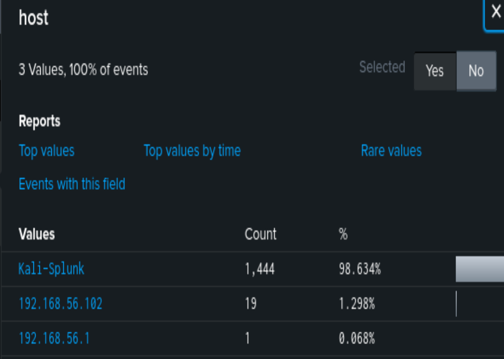
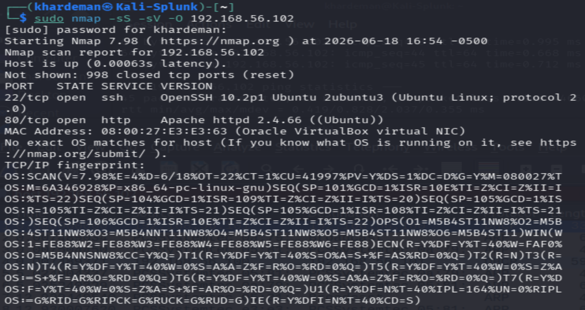
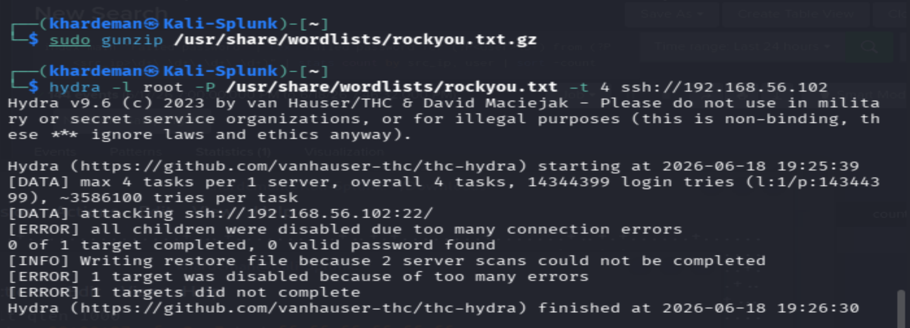
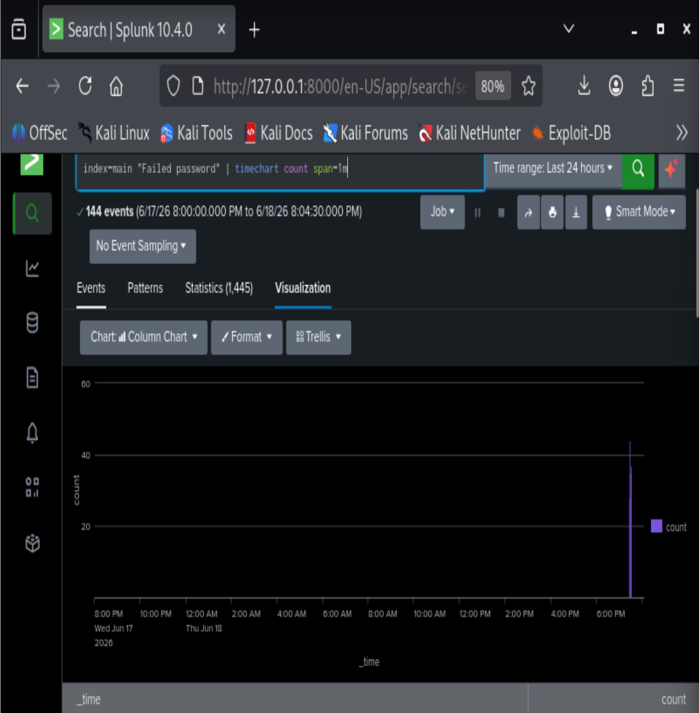

# SIEM & Incident Response Home Lab: SSH Brute Force Detection

A hands-on home lab simulating a real-world SOC investigation workflow — from the infrastructure build-out, to attack execution, detection, and analysis using both log-based and packet-based tooling.

## Overview

This lab was built to replicate the core workflow of a Tier 1/2 SOC analyst: standing up a monitored environment, executing a realistic attack (MITRE ATT&CK T1110 — Brute Force), and detecting it using both Splunk (log analysis) and Wireshark (packet capture). The goal was to understand not just *that* an attack happened, but to build the investigative muscle to answer *what* happened, *how* it happened, and *what evidence* supports that conclusion.

## Lab Architecture

- **Attacker/SIEM host:** Kali Linux 2026.1 running Splunk Enterprise 10.4.0
- **Target host:** Ubuntu Server 26.04 running OpenSSH and Apache2
- **Network:** Two VMs on a host-only adapter (192.168.56.0/24), with a second NAT adapter for internet access
- **Log pipeline:** Ubuntu forwards syslog and auth.log events to Splunk via `rsyslog` over UDP 514

```
[Ubuntu Server 192.168.56.102]  --rsyslog (UDP 514)-->  [Kali Linux 192.168.56.101]
   OpenSSH (22) / Apache2 (80)                              Splunk Enterprise 10.4.0
```

## Build Process

1. Deployed Kali Linux and Ubuntu Server VMs with dual network adapters (NAT + host-only).
2. Installed and configured Splunk Enterprise on Kali, resolving an initial DHCP/networking issue on the NAT adapter (`dhcpcd eth0`).
3. Installed and enabled `rsyslog` on Kali (absent by default), confirming flat-file log writing to `/var/log/auth.log` and `/var/log/syslog`.
4. Configured Splunk to monitor both log files locally, verifying live ingestion via Search & Reporting.
5. Configured Ubuntu's `rsyslog.conf` to forward all logs (`*.*`) to the Kali/Splunk host over UDP 514.
6. Created a corresponding UDP network input in Splunk (port 514, sourcetype `syslog`) and confirmed dual-host log ingestion (`index=main sourcetype=syslog`), verifying both Kali and Ubuntu appeared as distinct hosts.
7. Installed and enabled Apache2 on the Ubuntu target to expose a second service (port 80) alongside SSH (port 22).

**Verification — confirming the two-machine log pipeline:**



The `host` field breakdown confirms events were being ingested from both machines: Kali-Splunk (1,444 events, 98.6%) and the Ubuntu target at 192.168.56.102 (19 events, 1.3%), proving the rsyslog forwarding pipeline was operational end to end.

## Reconnaissance: Nmap Service Discovery (T1046)

Ran an Nmap SYN scan from Kali against the Ubuntu target to simulate the reconnaissance phase that precedes most credential attacks.



- **Result:** 2 open ports discovered — 22/tcp (OpenSSH 10.2p1), 80/tcp (Apache httpd 2.4.66)
- 998 ports returned RST, confirming closed state
- OS fingerprinted as Linux kernel
- Scan duration: 20.51 seconds

## Attack Simulation: SSH Brute Force (T1110)

**Tooling:** Hydra v9.6 against the Ubuntu SSH service, using the `rockyou.txt` wordlist (14,344,399 passwords from real-world breach data).



```
hydra -l root -P /usr/share/wordlists/rockyou.txt -t 4 ssh://192.168.56.102
```

- `-l root` — target account
- `-P` — password wordlist
- `-t 4` — 4 concurrent threads
- Ubuntu's SSH service began rate-limiting and rejecting connections partway through the attack — a realistic defensive response also seen in production environments.

## Detection & Analysis

Two tools were used together to build a complete picture of the attack, mirroring how a real SOC investigation combines host and network evidence:

| Tool | Layer | Answers |
|---|---|---|
| **Splunk** | Log/host level | Which account was targeted, how many attempts, which source IP |
| **Wireshark** | Packet/network level | TCP handshake pattern, SSHv2 negotiation, connection teardown/reconnect cadence |

**Wireshark capture:**
- Filter applied: `ip.addr == 192.168.56.102 && tcp.port == 22`
- Confirmed rapid SSHv2 connection attempts following the pattern: TCP handshake → SSHv2 negotiation → authentication failure → teardown, repeating hundreds of times per minute
- Capture preserved as `ssh_bruteforce_capture.pcap` for evidence retention
- *(Packet capture screenshot not included in this repo — methodology documented above from lab notes.)*

**Splunk detection:**



- Built a timechart visualization of failed password events over a 24-hour window
- Baseline: zero failed authentication events across the entire prior period
- Anomaly: a burst of approximately 44 failed login events within a single one-minute window at 19:29 on 6/18/2026
- This spike pattern, sudden, concentrated, and far outside the established baseline, is consistent with automated brute-force tooling and would not be generated by legitimate user behavior

## Key Findings

- Confirmed end-to-end log pipeline from a remote host into a centralized SIEM using industry-standard syslog forwarding
- Demonstrated the full attacker lifecycle: reconnaissance (Nmap) → credential attack (Hydra) → detection (Splunk + Wireshark)
- Validated that host-level defenses (SSH rate limiting) and detection tooling both responded appropriately to the simulated attack
- Practiced correlating log-level and packet-level evidence to build a defensible investigative timeline

## MITRE ATT&CK Mapping

- **T1046** — Network Service Discovery (Nmap reconnaissance)
- **T1110** — Brute Force (Hydra SSH credential attack)

## Skills Demonstrated

`Splunk (SIEM)` `Wireshark (Packet Analysis)` `Linux Administration` `rsyslog / Log Forwarding` `Nmap` `Hydra` `Incident Detection & Triage` `MITRE ATT&CK Framework` `Network Fundamentals (TCP/IP, SSH)`

## Notes

This lab is self-hosted on isolated, host-only virtual network adapters with no exposure to production networks or the public internet. All IP addresses referenced are private (RFC 1918) lab addresses.
